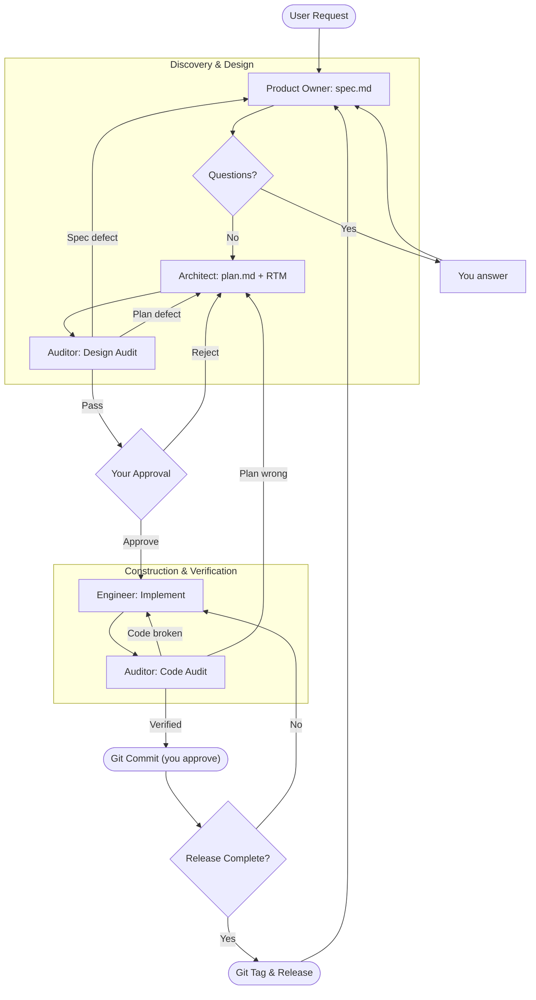

# Gemini Swarm & Modernization Toolkit

A Gemini CLI Extension that provides a **Multi-Agent Swarm** for autonomous software development.

**See** [Gemini CLI Extensions](https://github.com/google-gemini/gemini-cli/blob/main/docs/extensions/index.md) for more details.

**Credits**: [@dandobrin](https://github.com/ddobrin), [@jjdelorme](https://github.com/jjdelorme) & [@cedricyao](https://github.com/cedricyao). Parts of this work were adapted from Dan's [production serverless repository](https://github.com/GoogleCloudPlatform/serverless-production-readiness-java-gcp/tree/main/genai/quotes-llm/.gemini/commands).

## Prerequisites
Install the [Gemini CLI](https://github.com/google-gemini/gemini-cli)

## Extension Installation
From your command line:

```bash
gemini extensions install https://github.com/jjdelorme/plan-commands
```

That is the whole setup. The extension ships one skill (`swarm`) and four subagents (`product_owner`, `architect`, `engineer`, `auditor`). The Gemini CLI discovers them on its own; no per-project files, environment variables, or restarts are required.

### Using the Swarm
In any project, ask Gemini to use the swarm for a piece of work, for example:

> Use the swarm skill to add OAuth login to this service.

Gemini takes on the **Supervisor** role defined by the skill and drives the lifecycle below, stopping for your input only at the discovery questions, the plan approval gate, each commit, and each release tag.

---

## 🤖 The Autonomous Swarm

The swarm manages the software development lifecycle with a **Plan -> Audit -> Act -> Verify** state machine. Every hand-off between roles is a file under `plans/`, so the process is inspectable and resumable.

### The Roles
*   **Supervisor (`swarm` skill)**: The Project Manager. Enforces the state machine, relays questions and blockers to you, and is the only participant that runs `git commit`.
*   **Product Owner (`product_owner`)**: The Visionary. Turns your request and the research context into a traceable `spec.md` with stable requirement IDs, preserving domain rules verbatim, and maintains the Master Roadmap (`plans/00-ROADMAP.md`).
*   **Architect (`architect`)**: The Planner. Discovers repository governance rules, then writes a concrete `plan.md` whose Requirements Traceability Matrix maps every spec ID to a task and a named test.
*   **Engineer (`engineer`)**: The Builder. Implements one task at a time via Red-Green-Refactor and records blockers in the plan instead of guessing.
*   **Auditor (`auditor`)**: The Gatekeeper, in two modes. `audit_design` checks the spec against the research and the plan against the spec and governance before you are asked to approve anything. `audit_code` walks the traceability matrix, builds, runs the tests, and hunts for shortcuts before anything is committed.

### 🔄 Protocol Lifecycle



Automated return loops are capped. If the design audit rejects twice, the Supervisor stops and shows you the impasse rather than looping.

### Workspace Layout
```
plans/
  00-ROADMAP.md                      # Master roadmap (Product Owner)
  research/                          # Context reports before a milestone exists
  active_milestones/{moniker}/
    context.md                       # Research the spec must stay faithful to
    questions.md / answers.md        # Discovery questions and your decisions
    spec.md                          # Contract with INV-/AC-/EC-/C- IDs
    plan.md                          # Tasks, RTM, governance mandates, blockers
  audit/                             # Auditor reports (git-ignored)
```

### Workspace Maintenance: Archiving Plans
As the swarm executes, `plans/` accumulates completed milestones and reports. To keep the agent's context clean:

```bash
/swarm:archive
```
**What it does:**
1. Reads the Master Roadmap to identify completed milestones.
2. Moves the corresponding folders from `plans/active_milestones/` into `plans/archive/`.
3. Updates your project's `.geminiignore` so archived files are hidden from the AI's context.

### Extending the Swarm (Optional)
The core swarm is project-agnostic and reads your repository's own governance documents (agent instruction files, contributor guides, architecture indexes) to learn project-specific rules. Put project conventions there rather than editing the agents. You can also route work to specialized agents by adding rules to your project's `GEMINI.md`:

```markdown
# Swarm Routing & Delegation Rules
- For codebase investigation, delegate to the `scout` agent instead of investigating directly.
- The `auditor` agent MUST use the `graphdb` skill when verifying changes.
```

---

## 📝 Agile Refinement Commands

Standalone utilities for refining requirements, separate from the swarm.

### User Story Generation
*Generates agile user stories from an existing code base to help understand the current system or prepare for refactoring.*
*   **Command:** `/agile:create-user-stories {{path/to/code}}`
*   **Output:** `user-stories.md`
