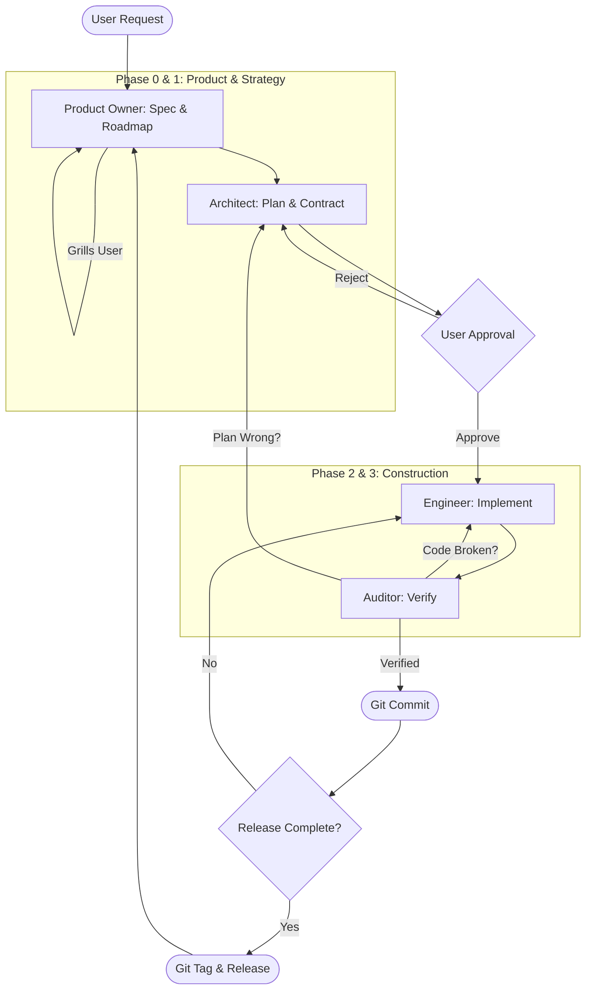

# Gemini Swarm & Modernization Toolkit

A comprehensive Gemini CLI Extension that provides a **Multi-Agent Swarm** for autonomous software development.

**See** [Gemini CLI Extensions](https://github.com/google-gemini/gemini-cli/blob/main/docs/extensions/index.md) for more details.

**Credits**: [@dandobrin](https://github.com/ddobrin), [@jjdelorme](https://github.com/jjdelorme) & [@cedricyao](https://github.com/cedricyao). Parts of this work were adapted from Dan's [production serverless repository](https://github.com/GoogleCloudPlatform/serverless-production-readiness-java-gcp/tree/main/genai/quotes-llm/.gemini/commands).

## Prerequisites
Install the [Gemini CLI](https://github.com/google-gemini/gemini-cli)

## Extension Installation
From your command line:

```bash
gemini extensions install https://github.com/jjdelorme/plan-commands
```

### Activating the Swarm Supervisor (Per-Workspace)

While the agents (`architect`, `engineer`, `auditor`) are installed globally by the extension, the **Supervisor** (`system.md`) must be activated locally in each project you want to use it in.

1. Navigate to your project directory.
2. Run the initialization command:
   ```bash
   /swarm:init
   ```
   *(This downloads the `system.md` file into your local `.gemini/` folder).*
3. **Restart** the Gemini CLI with the system override enabled:
   ```bash
   GEMINI_SYSTEM_MD=true gemini
   ```

---

## 🤖 The Autonomous Swarm

This extension packages a portable, framework-agnostic AI agent swarm designed to manage the software development lifecycle using a rigorous **Plan -> Act -> Verify** state machine.

### The Agents
*   **Supervisor (`system.md`)**: The Project Manager. Enforces the state machine, manages hand-offs, and gates Git commits.
*   **Product Owner (`product_owner`)**: The Visionary. Translates human ideas into rigorous specifications (`spec.md`) through interactive "grilling" and manages the Master Roadmap (`00-ROADMAP.md`) and Release targeting.
*   **Architect (`architect`)**: The Planner. Reads specs, creates comprehensive step-by-step TDD implementation plans in the `plans/active_milestones/` directory.
*   **Engineer (`engineer`)**: The Builder. Strictly follows the Architect's plans, writing tests and implementing changes via Red-Green-Refactor.
*   **Auditor (`auditor`)**: The Gatekeeper. Verifies the Engineer's work against the spec and tests. Compiles code, runs tests, and hunts for lazy AI shortcuts.

### 🔄 Protocol Lifecycle
The system moves through distinct phases, enforced by the Supervisor.



### Workspace Maintenance: Archiving Plans
As the Swarm executes tasks, your `plans/` directory will accumulate executed task files, research reports, and review feedback. To keep the agent's context window clean and focused, you can archive completed items:

```bash
/swarm:archive
```
**What it does:**
1. Reads your Master Roadmap to identify completed milestones and tasks.
2. Moves all corresponding completed files into a `plans/archive/` directory.
3. Automatically updates your project's `.geminiignore` to ensure archived files are hidden from the AI's context in future turns.

### Extending the Swarm (Optional)
The core swarm is agnostic. To add deep codebase intelligence (like a Graph Database), install a specialized skill/agent in your project and update your project's `GEMINI.md` to instruct the swarm to use it:

```markdown
# Swarm Routing & Delegation Rules (Add to your project's GEMINI.md)
- For codebase investigation, you MUST delegate to the `scout` agent. Do NOT use the built-in investigator.
- The `auditor` agent MUST utilize the `graphdb` skill for verifying changes.
```

---

## 📝 2. Agile Refinement Commands

This toolkit also includes standalone utilities for refining your project requirements and mapping out new tasks, which are entirely separate from the automated agent swarm. 

### User Story Generation
*Generates agile user stories from an existing code base to help understand the current system or prepare for refactoring.*
*   **Command:** `/agile:create-user-stories {{path/to/code}}`
*   **Output:** `user-stories.md`